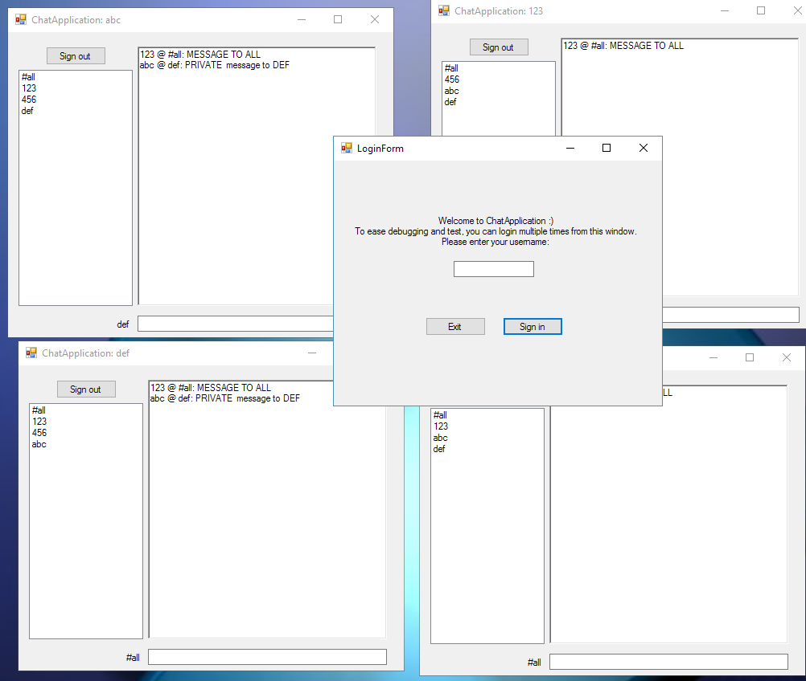

## Chat Application

I wrote this small chat application for fun and practice. I had a time constraint, so unit testing and variable naming is not optimal.

Each client is a file, which is checked on each write. Any message in the format
`<sending user> <recipient> <message>`
is acknowledged and forwarded to the winforms GUI.
There is a server channel which acts as a broadcast channel. Any message inserted here is forwarded to all clients (i.e. files) in the same directory. The server directory is given by .NET's `System.IO.Path.GetTempPath()`.  

Rather than communicating through windows forms, you can also use other utilities like `touch fifo/username` and `echo "myusername #all Hello, World" >> fifo/otherusername`

This program does **not** work well under Mono/Wine, since I have no special handling of UNIX filenames.

### Constraints  
  * Try not to use more than 5 hours (exceeded)
  * Do not rely too heavily on existing libraries or other people's code

  

#### License
I chose [unlicense](http://unlicense.org/), so you can basically use any code as you'd like.
